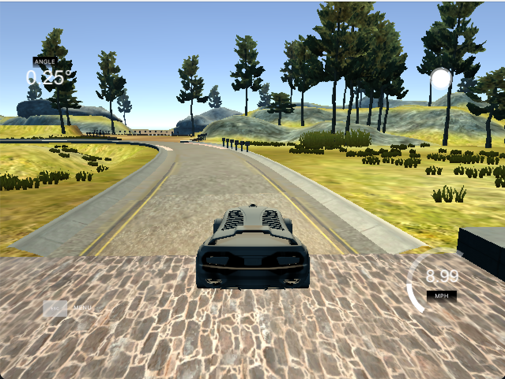
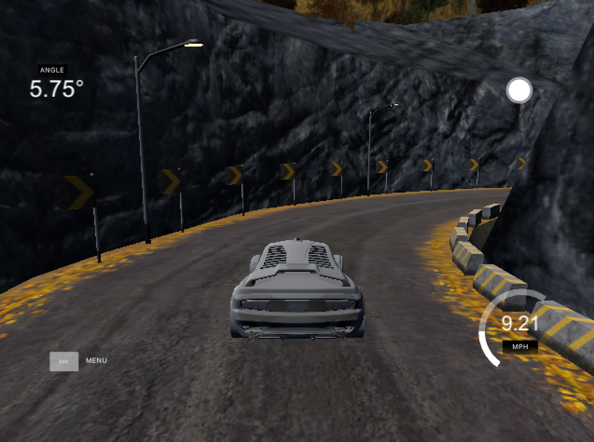

# **Behavioral Cloning** 

## Rubric Points
### Here I will consider the [rubric points](https://review.udacity.com/#!/rubrics/432/view) individually and describe how I addressed each point in my implementation.  

---
### Files Submitted & Code Quality

#### 1. Submission includes all required files and can be used to run the simulator in autonomous mode

My project includes the following files:
* model.py containing the script to create and train the model
* drive.py for driving the car in autonomous mode
* model.h5 containing a trained model in the Udacity workspace
* writeup.md summarizing the results
* run1.mp4 containing video of the simulation car driving itself in the default map

### Quality of Code

#### 1. Submission includes functional code
To apply the trained model to the Udacity simulator, execute the following:
```sh
python drive.py model.h5
```

#### 2. Submission code is usable and readable

The model.py file contains doctrings and comments to imporove understanding. A python generator is also created at `line 21` of `model.py` to generate samples for the training.

### Model Architecture and Training Strategy

#### 1. An appropriate model architecture has been employed

Transfer learning is applied in buidling the model on `line 86` of `model.py`. The neural network used a pretrained GoogLeNet, `InceptionV3` with the [imagenet](https://www.kaggle.com/c/imagenet-object-localization-challenge) dataset, imported from Keras: [https://keras.io/api/applications/inceptionv3/](https://keras.io/api/applications/inceptionv3/).

The weights are trainable by default. The end layer is dropped and replaced by average pooling layer and then two fully convolutional layers. Custom input layers are also appended to normalize, crop, and resize images to fit the model using `keras.layers.Lambda` and `keras.layers.Cropping2D`.

#### 2. Attempts to reduce overfitting in the model

The model was trained and validated on different datasets to make sure that there is no overfitting at `line 11-14` of `model.py`.

#### 3. Model parameter tuning

The model used an adam optimizer, so the learning rate was not tuned manually (`line 124` of `model.py`).

#### 4. Appropriate training data

The training data were obtained from my local machine with the version 1 of the Udacity Term 1 simulator. The data contains the car driving the lane from both map 1 and map 2:




* Data from map 1:
  * 1 lap driving on the middle counter-clockwise direction
  * 1 lap driving on the middle clockwise direction
  * 2 laps recovering from the left and right sides of the road
* Data from map 2:
  * 1 lap on the middle default direction
  * 1 lap on the middle the otherwise
  
The car was driven with a PS4 controller for a more accurate steering control.

See more on the next section on how the dataset was augmented.

### Model Architecture and Training Strategy

#### 1. Solution Design Approach

The overall approach in the working of this project is inspired from the approach demonstrated by the instructor in the classroom lessons:
1. Gathering new samples: elaborated on the section above and the point 3 below.

2. Creating simple DNN (1 convolutional layer, 1 flatten and 1 fully connected) to test image preprocessing:
   
   In order to see whether any of my image preprocessing would result in lower `val_loss` or better autonomous driving, I created a simple DNN with one convolutional layer, 1 flatten layer, and 1 fully connected layer as to receive the preprocessed images.

3. Tinkering with the image processings:
   
   First, I normalized the images by this formula: (img/255)-0.5; as a simple and lazy approach, but definitely resulting in better model. Then, as suggested in the classroom, I applied cropping to the top 50px and the lower 20px of the image. These numbers were based on a trial and error process: initially I cropped 70px from the top of the image.

4. Building a more complex network by applying transfer learning:
   
   As taught in the classroom, I applied transfer learning to the GoogLeNet as seen in the code at `line 86` of `model.py`. The preprocessing codes are replaced with `keras.layers.Lambda` and `keras.layers.Cropping2D`.

5. Building sample generator:

   As suggested in the classroom, I created sample generator as seen at `line 21` of `model.py`, so that the memory management would be more efficient and the training would work Udacity classroom. The detail of side-camera extraction and data augmentation are elaborated in the point 3 below.
   
6. Exporting the samples to the Udacity workspace: elaborated in point 3 below.

7. Training the model: elaborated in point 3 below.

8. Testing the model in the Udacity workspace simulator:

	Running `drive.py` in the Udacity workspace had not worked initially. I needed to pass the tensorflow 'tf' variable to the loaded model as at `line 123` of `drive.py`. Also, the `tensorflow-gpu` needed to be updated to version 1.4 to execute the file successfully.

   The model resulted from the training enabled the car to successfully drive autonomously in Map 1 of the Udacity workspace simulator, as seen under the file `run1.mp4`. However, since the Map 2 of the Udacity workspace simulator is of the version 2 (different from the Map 2 of the version 1, of the the training dataset was obtained from), the car did horrible. Further gathering sample from the Map 2 of the version 2 simulator would alleviate this issue and might improve the chance of the car being able to drive autonomously.

#### 2. Final Model Architecture

Here is the summary of the model architecture:

```shell
Model: "model_1"
_________________________________________________________________
Layer (type)                 Output Shape              Param #   
=================================================================
input_2 (InputLayer)         (None, 160, 320, 3)       0         
_________________________________________________________________
lambda_1 (Lambda)            (None, 160, 320, 3)       0         
_________________________________________________________________
cropping2d_1 (Cropping2D)    (None, 90, 320, 3)        0         
_________________________________________________________________
lambda_2 (Lambda)            (None, 139, 139, 3)       0         
_________________________________________________________________
inception_v3 (Model)         (None, 3, 3, 2048)        21802784  
_________________________________________________________________
global_average_pooling2d_1 ( (None, 2048)              0         
_________________________________________________________________
dense_1 (Dense)              (None, 512)               1049088   
_________________________________________________________________
dense_2 (Dense)              (None, 1)                 513       
=================================================================
Total params: 22,852,385
Trainable params: 22,817,953
Non-trainable params: 34,432
```

As explained in prior section, I used transfer learning by using GoogLeNet (`InceptionV3`) with pretrained weights of the imagenet and set them to be trainable. Besides dropping the end layer, I added some input layers for preprocessing the images and some end layers to output a single steering value.

Also, as the layers in the GoogLeNet are many, I skipped visualizing them in this version of the project.

#### 3. Creation of the Training Set & Training Process

After obtaining the dataset as described in the previous section, I exported it to a Google Drive and saved them to the Udacity workspace under the `/opt` directory. Then, I created a generator that generates more data by extracting the left-side and the right-side camera and by transforming them to augment the dataset. The code for them is under the `sample_generator()` function at `line 21` of the `model.py`.

Inside the generator, for each center camera image path, I extracted the paths of the left and right camera images and used a lazy correction of `0.2` to be added to the left-image steering value and to be extracted from the right-image steering value, so the model would learn to steer to the right when the car is at the left side of the road and vice versa. Also, for each camera image, I created augmented images by flipping them horizontally and set their steering value to its inverse (its negative).

Before feeding the generator with the data, the dataframe of the image paths was shuffled as on `line 111` under the `model.py`. Right after the instantiation of the generator, the data would be again shuffled as at `line 34` of the `model.py`, just to ensure shuffling to be applied.

All in all, the final dataset consisted of 31,680 images. Before the training, the dataset were splitted into training and validation datasets with the ratio of 80:20, and then fed to the generator at `line 113-114` of `model.py`.

Also, before the training, I set a couple of callbacks to ensure that the training only save the best model and to stop early if the `val_loss` is not decreasing for several times. The code is at `line 116-119` of `model.py`.

The training is executed by the code at `line 126` of `model.py` by passing the generators and set the `epochs=10`.
